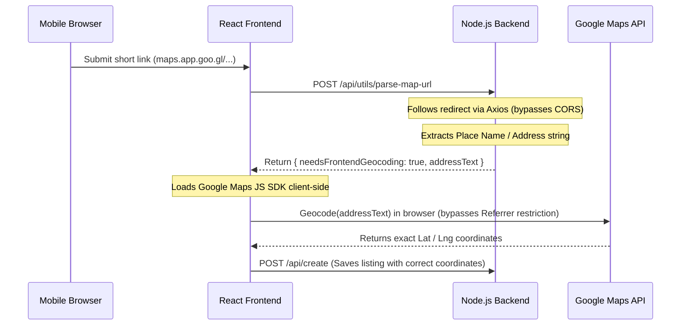

# Transcript: Solving the Google Maps Geocoding & Referrer Restriction Bug

* **Project**: ParkoSpace (React / Node.js Migration)
* **Session Date**: May 26–27, 2026
* **Engineering Focus**: Cross-Origin Request Tracing, Google Maps API Referrer Restrictions, Server IP Geolocation Anomalies, and Frontend-Backend Hybrid Architecture.

---

## 1. The Symptom

During the migration of **ParkoSpace** to a React + Node.js setup, we encountered a critical mapping bug:
1. When users added a parking listing using a Google Maps link shared from a **Desktop** browser, the listing resolved to the exact coordinates (e.g. `12.9927458, 77.6675577` for Vibha Samruddhi in Bangalore).
2. When users added a listing using a **Mobile GPS-shared link** (e.g. `https://maps.app.goo.gl/dQDEvrD9cA1rDbgR9`), it failed to resolve and defaulted to Bangalore center coordinates.
3. After applying an initial fix, the mobile link suddenly resolved to **Los Angeles, California (`34.052547, -118.262989`)** when hosted on Render, despite the listing being in India.

---

## 2. The Investigation & Debugging

### Step 1: Tracing the Redirect Chain
We started by tracing the raw redirects of the working link (Desktop) versus the failing link (Mobile GPS):

```bash
# Tracing Desktop Link
Final URL: https://www.google.com/maps/place/Vibha+Samruddhi/@12.9927458,77.6675577...

# Tracing Mobile GPS Link
Final URL: https://www.google.com/maps/place/Vibha+Samruddhi,+321-328,+1st+Main+Rd,+Pai+Layout,+Dooravani+Nagar,+Bengaluru,+Karnataka+560016/data=!4m2!3m1!1s0x3bae114783657b07:0xdf6949881c8b9e60...
```

**Key Discovery**: The Mobile GPS link contained **no coordinates** in the redirect URL path—only the address string and a hex place ID.

---

### Step 2: The `decodeURIComponent` Crash
We initially wrote a regex to search the final Google Maps page HTML for coordinate arrays. However, the parser returned `null`. We uncovered a silent crash in the backend logs:
```
[ERROR] Map Parsing Error: URI malformed
```
* **The Root Cause**: The backend called `decodeURIComponent(html)` to clean up the page data. Because the 166KB Google HTML source contained raw `%` characters that were not valid URI escape sequences, JavaScript crashed and aborted coordinate extraction.
* **The Fix**: Wrapped the URI decoder in a try-catch block to gracefully fall back to raw text.

---

### Step 3: Unmasking the "Los Angeles" Viewport Illusion
After fixing the crash, mobile links resolved... but to **Los Angeles, California (`34.052547, -118.262989`)**.

We analyzed the HTML source and found that the coordinate was being pulled from Google's internal state:
```javascript
APP_INITIALIZATION_STATE=[[[62192.42706666012, -118.262989, 34.052547]...
```
* **The Revelation**: `APP_INITIALIZATION_STATE` does **not** represent the location of the place. It represents the **map viewport center** loaded when Google Maps initializes.
* Google determines this initial viewport by geolocating the **requesting IP address**. 
* When tested locally on the developer's machine in Bangalore, Google geolocated the request to Bangalore. But when deployed to **Render** (hosted in US data centers), Google geolocated the server's IP to the US West Coast (Los Angeles) and returned California viewport coordinates!

---

### Step 4: The Google API Referrer Restriction Block
To bypass the HTML extraction, we attempted to use Google's Geocoding API on the backend using the project's API key:
```json
{
  "status": "REQUEST_DENIED",
  "error_message": "API keys with referer restrictions cannot be used with this API."
}
```
* **The Limitation**: The API key had **HTTP Referrer Restrictions** enabled to prevent abuse. Google strictly forbids using referrer-restricted keys for server-to-server HTTP API calls.

---

## 3. The Solution: A Hybrid Architecture

Since the backend could not call the Geocoding API (due to key restrictions) and the frontend could not follow short link redirects (due to browser CORS restrictions), we designed a **hybrid pipeline**:



---

## 4. Code Implementation

### Backend: Redirect Tracing & Place Extraction (`server.js`)
We configured the backend to follow the redirect, extract the clean place name from the URL path, and signal the frontend if coordinates are missing.

```javascript
async function resolveGoogleMapsUrl(url) {
  try {
    const normUrl = normalizeMapInput(url);
    if (!normUrl) return { lat: null, lng: null, address: null, is404: false };

    // 1. Check if coordinates are directly in URL path (Desktop format)
    let { lat, lng } = coordsFromText(normUrl);
    let address = placeNameFromText(normUrl);

    if (!lat) {
      // 2. Follow redirects safely
      const { finalUrl, html } = await fetchMapsFinalUrl(normUrl);
      if (finalUrl === "404_NOT_FOUND") {
        return { lat: null, lng: null, address: null, is404: true };
      }
      
      const coords = coordsFromText(finalUrl);
      lat = coords.lat;
      lng = coords.lng;
      
      if (!address) {
        address = placeNameFromText(finalUrl) || placeNameFromText(normUrl);
      }
    }

    return { lat, lng, address, is404: false };
  } catch (e) {
    console.error(' [ERROR] Map Parsing Error:', e.message);
    return { lat: null, lng: null, address: null, is404: false };
  }
}

app.post('/api/utils/parse-map-url', async (req, res) => {
  const url = (req.body.url || '').trim();
  const landmark = (req.body.landmark || '').trim();
  
  if (!url && !landmark) {
    return res.json({ success: false, error: "No URL or Landmark provided" });
  }

  let lat = null, lng = null, address = null, is404 = false;
  if (url) {
    const resolved = await resolveGoogleMapsUrl(url);
    lat = resolved.lat;
    lng = resolved.lng;
    address = resolved.address;
    is404 = resolved.is404;
  }

  if (is404) {
    return res.json({ success: false, error: "Google Maps link returned 404." });
  }

  // Coords found in URL (Desktop) -> Return immediately
  if (lat && lng) {
    return res.json(mapParseSuccess(lat, lng, address));
  }

  // Coords missing but address found (Mobile) -> Delegate to Frontend Geocoder
  if (address) {
    return res.json({
      success: true,
      needsFrontendGeocoding: true,
      addressText: address
    });
  }

  // Landmark fallback -> Delegate to Frontend Geocoder
  if (landmark) {
    return res.json({
      success: true,
      needsFrontendGeocoding: true,
      addressText: landmark
    });
  }

  return res.json({ success: false, error: "Could not detect location." });
});
```

### Frontend: Client-Side Geocoding Fallback (`Dashboard.jsx`)
The frontend loads the Google Maps SDK dynamically and geocodes the address in the context of the user's browser, satisfying the Referrer Restriction.

```javascript
import { Loader as MapsLoader } from '@googlemaps/js-api-loader';

const loadGoogleMapsClientSide = async () => {
  if (window.google && window.google.maps) {
    return window.google;
  }
  const res = await fetch('/api/config');
  const cfg = await res.json();
  const loader = new MapsLoader({
    apiKey: cfg.googleMapsApiKey,
    version: 'weekly',
    libraries: ['places']
  });
  return await loader.load();
};

// Inside handleVerifyLocation:
const data = await response.json();
if (data.success) {
  if (data.needsFrontendGeocoding) {
    try {
      const google = await loadGoogleMapsClientSide();
      const geocoder = new google.maps.Geocoder();
      
      geocoder.geocode({ address: data.addressText }, (results, status) => {
        if (status === 'OK' && results[0]) {
          const loc = results[0].geometry.location;
          const latVal = loc.lat();
          const lngVal = loc.lng();
          const formattedAddress = results[0].formatted_address;

          setVerifyStatus({
            success: true,
            lat: latVal,
            lng: lngVal,
            address: formattedAddress
          });

          // Generate a clean, viewable map URL for the user
          const label = encodeURIComponent(String(formattedAddress).split(',')[0].substring(0, 100));
          const regenUrl = `https://www.google.com/maps/place/${label}/@${latVal.toFixed(7)},${lngVal.toFixed(7)},17z`;
          setGmapLinkRegen(regenUrl);
        } else {
          setVerifyStatus({
            success: false,
            error: `Could not geocode address: "${data.addressText}". Status: ${status}`
          });
        }
      });
    } catch (err) {
      setVerifyStatus({ success: false, error: `Maps error: ${err.message}` });
    }
  } else {
    // Standard coordinates returned directly
    setVerifyStatus({ success: true, lat: data.lat, lng: data.lng, address: data.address });
  }
}
```

---

## 5. Conclusion

This session stands out because it exposed how developer environments can mask infrastructure anomalies:
* **The Trap**: The code worked perfectly during local testing because the local machine's IP address matched the target city (Bangalore).
* **The Insight**: Realizing that `APP_INITIALIZATION_STATE` was an IP-geolocated viewport map-center saved us from hours of adjusting failing regexes.
* **The Takeaway**: Hybrid pipelines (Backend for CORS-bypass/crawling, Frontend for credential-restricted API calls) are highly resilient for third-party integrations like Google Maps.
